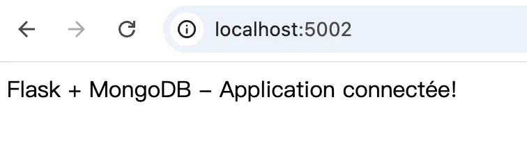
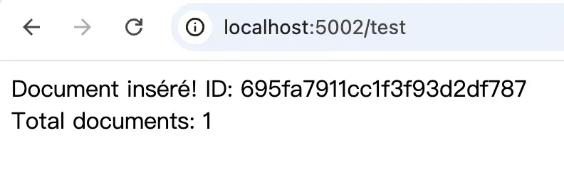
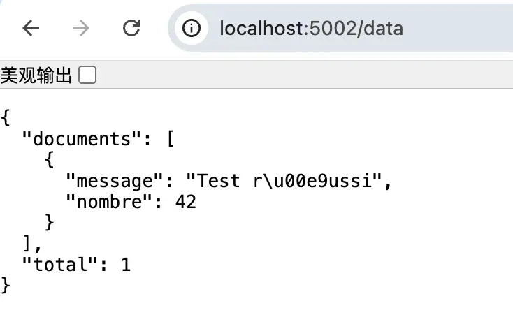

# Exercice 6 : Utilisation de Docker Compose

## Fichiers créés

### 1. app.py
Application Flask avec connexion MongoDB.
```python
from flask import Flask
from pymongo import MongoClient
from pymongo.errors import ConnectionFailure

app = Flask(__name__)

# Connexion à MongoDB
try:
    client = MongoClient('mongodb://mongo:27017/', serverSelectionTimeoutMS=5000)
    client.admin.command('ping')
    db = client['test_database']
    print("Connexion à MongoDB réussie!")
except ConnectionFailure:
    print("Échec de connexion à MongoDB")
    db = None

@app.route('/')
def hello():
    return "Flask + MongoDB - Application connectée!"

@app.route('/test')
def test_db():
    if db is None:
        return "Erreur: MongoDB non connecté", 500
    
    try:
        collection = db['test_collection']
        result = collection.insert_one({'message': 'Test réussi', 'nombre': 42})
        count = collection.count_documents({})
        return f"Document inséré! ID: {result.inserted_id}<br>Total documents: {count}"
    except Exception as e:
        return f"Erreur: {str(e)}", 500

@app.route('/data')
def show_data():
    if db is None:
        return "Erreur: MongoDB non connecté", 500
    
    try:
        collection = db['test_collection']
        documents = list(collection.find({}, {'_id': 0}).limit(10))
        return {'documents': documents, 'total': len(documents)}
    except Exception as e:
        return f"Erreur: {str(e)}", 500

if __name__ == '__main__':
    app.run(host='0.0.0.0', port=5000, debug=True)
```

**Explication :** Cette application Flask se connecte à MongoDB et propose trois routes : page d'accueil, test d'insertion, et affichage des données.

---

### 2. Dockerfile
```dockerfile
FROM python:3.9-slim

WORKDIR /app

COPY app.py .

RUN pip install flask pymongo

EXPOSE 5000

CMD ["python", "app.py"]
```

**Explication :** Dockerfile pour créer l'image Flask avec les dépendances pymongo.

---

### 3. docker-compose.yml
```yaml
version: '3.8'

services:
  flask:
    build: .
    ports:
      - "5002:5000"
    depends_on:
      - mongo
    networks:
      - app-network
    environment:
      - FLASK_ENV=development

  mongo:
    image: mongo:latest
    ports:
      - "27017:27017"
    networks:
      - app-network
    volumes:
      - mongo-data:/data/db

networks:
  app-network:
    driver: bridge

volumes:
  mongo-data:
```

**Explication :**
- `services` : définit deux services (flask et mongo)
- `depends_on` : flask attend que mongo soit prêt
- `networks` : réseau partagé pour la communication entre conteneurs
- `volumes` : persistence des données MongoDB

---

## Étapes d'exécution

### 1. Démarrage avec Docker Compose

**Commande :**
```bash
docker-compose up -d
```

**Résultat :**
```
[+] Running 9/9
 ✔ mongo Pulled                                                                                                                                                        17.6s 
   ✔ e4ff4183d396 Pull complete                                                                                                                                         0.4s 
   ✔ 90aac4a84565 Pull complete                                                                                                                                         3.2s 
   ✔ cec3fd50f49f Pull complete                                                                                                                                        13.4s 
   ✔ 97dd3f0ce510 Pull complete                                                                                                                                         3.1s 
   ✔ fe1d960a6567 Pull complete                                                                                                                                         1.0s 
   ✔ 3ab158345587 Pull complete                                                                                                                                         0.9s 
   ✔ bdb9ad4997b8 Pull complete                                                                                                                                         0.8s 
   ✔ be6c93d4528b Pull complete                                                                                                                                         0.8s 
[+] Building 8.9s (12/12) FINISHED                                                                                                                                           
 => [internal] load local bake definitions                                                                                                                              0.0s
 => => reading from stdin 637B                                                                                                                                          0.0s
 => [internal] load build definition from Dockerfile                                                                                                                    0.0s
 => => transferring dockerfile: 156B                                                                                                                                    0.0s
 => [internal] load metadata for docker.io/library/python:3.9-slim                                                                                                      1.1s
 => [auth] library/python:pull token for registry-1.docker.io                                                                                                           0.0s
 => [internal] load .dockerignore                                                                                                                                       0.0s
 => => transferring context: 2B                                                                                                                                         0.0s
 => [1/4] FROM docker.io/library/python:3.9-slim@sha256:2d97f6910b16bd338d3060f261f53f144965f755599aab1acda1e13cf1731b1b                                                0.0s
 => => resolve docker.io/library/python:3.9-slim@sha256:2d97f6910b16bd338d3060f261f53f144965f755599aab1acda1e13cf1731b1b                                                0.0s
 => [internal] load build context                                                                                                                                       0.0s
 => => transferring context: 1.53kB                                                                                                                                     0.0s
 => CACHED [2/4] WORKDIR /app                                                                                                                                           0.0s
 => [3/4] COPY app.py .                                                                                                                                                 0.6s
 => [4/4] RUN pip install flask pymongo                                                                                                                                 5.7s
 => exporting to image                                                                                                                                                  1.2s 
 => => exporting layers                                                                                                                                                 1.0s 
 => => exporting manifest sha256:b99614bf6f64e625898b8378a91ca944b32643d654eb0944a49337db81a1f09c                                                                       0.0s 
 => => exporting config sha256:9b1a669d181eafd346a5d3f329edaa2b5f47b1cbb4815a0efddbd3c750ad2aba                                                                         0.0s 
 => => exporting attestation manifest sha256:42f2d5e6c0c68a8fc9a0fad0a764db0f663cf1df9a4aed2ca31d0c53bc234dd8                                                           0.0s 
 => => exporting manifest list sha256:a903c9702afc873e35623de7f5fa42b30ffa354f8d82cd4ffa9dd6fc7654984f                                                                  0.0s 
 => => naming to docker.io/library/exercice6-docker-compose-flask:latest                                                                                                0.0s
 => => unpacking to docker.io/library/exercice6-docker-compose-flask:latest                                                                                             0.2s
 => resolving provenance for metadata file                                                                                                                              0.0s
[+] Running 5/5
 ✔ exercice6-docker-compose-flask                Built                                                                                                                  0.0s 
 ✔ Network exercice6-docker-compose_app-network  Created                                                                                                                0.0s 
 ✔ Volume "exercice6-docker-compose_mongo-data"  Created                                                                                                                0.0s 
 ✔ Container exercice6-docker-compose-mongo-1    Started                                                                                                                0.3s 
 ✔ Container exercice6-docker-compose-flask-1    Started
```

**Explication :** Docker Compose construit l'image Flask, crée le réseau et les volumes, puis démarre les deux conteneurs en arrière-plan.

---

### 2. Vérification des services

**Commande :**
```bash
docker-compose ps
```

**Résultat :**
```
NAME                               IMAGE                            COMMAND                  SERVICE   CREATED         STATUS         PORTS
exercice6-docker-compose-flask-1   exercice6-docker-compose-flask   "python app.py"          flask     2 minutes ago   Up 2 minutes   0.0.0.0:5002->5000/tcp
exercice6-docker-compose-mongo-1   mongo:latest                     "docker-entrypoint.s…"   mongo     2 minutes ago   Up 2 minutes   0.0.0.0:27017->27017/tcp
```

**Explication :** Les deux services sont actifs avec leurs ports exposés.

---

### 3. Vérification des logs Flask

**Commande :**
```bash
docker-compose logs flask
```

**Résultat :**
```
flask-1  | Connexion à MongoDB réussie!
flask-1  |  * Serving Flask app 'app'
flask-1  |  * Debug mode: on
flask-1  | WARNING: This is a development server. Do not use it in a production deployment. Use a production WSGI server instead.
flask-1  |  * Running on all addresses (0.0.0.0)
flask-1  |  * Running on http://127.0.0.1:5000
flask-1  |  * Running on http://172.18.0.3:5000
flask-1  | Press CTRL+C to quit
flask-1  |  * Restarting with stat
flask-1  |  * Debugger is active!
flask-1  |  * Debugger PIN: 847-613-172
flask-1  | 192.168.65.1 - - [08/Jan/2026 12:47:52] "GET / HTTP/1.1" 200 -
flask-1  | 192.168.65.1 - - [08/Jan/2026 12:47:52] "GET /favicon.ico HTTP/1.1" 404 -
flask-1  | 192.168.65.1 - - [08/Jan/2026 12:48:17] "GET /test HTTP/1.1" 200 -
flask-1  | 192.168.65.1 - - [08/Jan/2026 12:48:44] "GET /data HTTP/1.1" 200 -
```

**Explication :** Flask démarre correctement et se connecte avec succès à MongoDB via le nom de service 'mongo'.

---

### 4. Vérification des logs MongoDB

**Commande :**
```bash
docker-compose logs mongo
```

**Résultat (extrait) :**
```
mongo-1  | {"t":{"$date":"2026-01-08T12:47:03.099+00:00"},"s":"I",  "c":"-",        "id":8991200, "ctx":"main","msg":"Shuffling initializers","attr":{"seed":3911458558}}
mongo-1  | {"t":{"$date":"2026-01-08T12:47:03.107+00:00"},"s":"I",  "c":"CONTROL",  "id":97374,   "ctx":"main","msg":"Automatically disabling TLS 1.0 and TLS 1.1, to force-enable TLS 1.1 specify --sslDisabledProtocols 'TLS1_0'; to force-enable TLS 1.0 specify --sslDisabledProtocols 'none'"}
mongo-1  | {"t":{"$date":"2026-01-08T12:47:03.108+00:00"},"s":"I",  "c":"NETWORK",  "id":4915701, "ctx":"main","msg":"Initialized wire specification","attr":{"spec":{"incomingExternalClient":{"minWireVersion":0,"maxWireVersion":27},"incomingInternalClient":{"minWireVersion":0,"maxWireVersion":27},"outgoing":{"minWireVersion":6,"maxWireVersion":27},"isInternalClient":true}}}
mongo-1  | {"t":{"$date":"2026-01-08T12:47:03.109+00:00"},"s":"I",  "c":"CONTROL",  "id":5945603, "ctx":"main","msg":"Multi threading initialized"}
mongo-1  | {"t":{"$date":"2026-01-08T12:47:03.109+00:00"},"s":"I",  "c":"CONTROL",  "id":4615611, "ctx":"initandlisten","msg":"MongoDB starting","attr":{"pid":1,"port":27017,"dbPath":"/data/db","architecture":"64-bit","host":"30944ba3ea25"}}
mongo-1  | {"t":{"$date":"2026-01-08T12:47:03.109+00:00"},"s":"I",  "c":"CONTROL",  "id":23403,   "ctx":"initandlisten","msg":"Build Info","attr":{"buildInfo":{"version":"8.2.3","gitVersion":"36f41c9c30a2f13f834d033ba03c3463c891fb01","openSSLVersion":"OpenSSL 3.0.13 30 Jan 2024","modules":[],"allocator":"tcmalloc-google","environment":{"distmod":"ubuntu2404","distarch":"aarch64","target_arch":"aarch64"}}}}
mongo-1  | {"t":{"$date":"2026-01-08T12:47:03.109+00:00"},"s":"I",  "c":"CONTROL",  "id":51765,   "ctx":"initandlisten","msg":"Operating System","attr":{"os":{"name":"Ubuntu","version":"24.04"}}}
mongo-1  | {"t":{"$date":"2026-01-08T12:47:03.109+00:00"},"s":"I",  "c":"CONTROL",  "id":21951,   "ctx":"initandlisten","msg":"Options set by command line","attr":{"options":{"net":{"bindIp":"*"}}}}
mongo-1  | {"t":{"$date":"2026-01-08T12:47:03.110+00:00"},"s":"I",  "c":"NETWORK",  "id":4648601, "ctx":"initandlisten","msg":"Implicit TCP FastOpen unavailable. If TCP FastOpen is required, set at least one of the related parameters","attr":{"relatedParameters":["tcpFastOpenServer","tcpFastOpenClient","tcpFastOpenQueueSize"]}}
mongo-1  | {"t":{"$date":"2026-01-08T12:47:03.113+00:00"},"s":"I",  "c":"STORAGE",  "id":22297,   "ctx":"initandlisten","msg":"Using the XFS filesystem is strongly recommended with the WiredTiger storage engine. See http://dochub.mongodb.org/core/prodnotes-filesystem","tags":["startupWarnings"]}
mongo-1  | {"t":{"$date":"2026-01-08T12:47:03.113+00:00"},"s":"I",  "c":"STORAGE",  "id":22315,   "ctx":"initandlisten","msg":"Opening WiredTiger","attr":{"config":"create,cache_size=3406M,session_max=33000,eviction=(threads_min=4,threads_max=4),config_base=false,statistics=(fast),log=(enabled=true,remove=true,path=journal,compressor=snappy),builtin_extension_config=(zstd=(compression_level=6)),file_manager=(close_idle_time=600,close_scan_interval=10,close_handle_minimum=2000),statistics_log=(wait=0),json_output=(error,message),verbose=[recovery_progress:1,checkpoint_progress:1,compact_progress:1,live_restore_progress:1,backup:0,checkpoint:0,compact:0,eviction:0,fileops:0,history_store:0,live_restore:0,recovery:0,rts:0,salvage:0,tiered:0,timestamp:0,transaction:0,verify:0,log:0],prefetch=(available=true,default=false),"}}
mongo-1  | {"t":{"$date":"2026-01-08T12:47:03.127+00:00"},"s":"I",  "c":"WTRECOV",  "id":22430,   "ctx":"initandlisten","msg":"WiredTiger message","attr":{"message":{"ts_sec":1767876423,"ts_usec":127877,"thread":"1:0xffff81ab6040","session_name":"wiredtiger_open","category":"WT_VERB_RECOVERY","log_id":1000000,"category_id":32,"verbose_level":"INFO","verbose_level_id":0,"msg":"opening the WiredTiger library"}}}
mongo-1  | {"t":{"$date":"2026-01-08T12:47:03.145+00:00"},"s":"I",  "c":"WTRECOV",  "id":22430,   "ctx":"initandlisten","msg":"WiredTiger message","attr":{"message":{"ts_sec":1767876423,"ts_usec":145442,"thread":"1:0xffff81ab6040","session_name":"connection","category":"WT_VERB_RECOVERY","log_id":1000000,"category_id":32,"verbose_level":"INFO","verbose_level_id":0,"msg":"connection configuration string parsing completed"}}}
mongo-1  | {"t":{"$date":"2026-01-08T12:47:03.156+00:00"},"s":"I",  "c":"WTRECOV",  "id":22430,   "ctx":"initandlisten","msg":"WiredTiger message","attr":{"message":{"ts_sec":1767876423,"ts_usec":156886,"thread":"1:0xffff81ab6040","session_name":"connection","category":"WT_VERB_RECOVERY","log_id":1000000,"category_id":32,"verbose_level":"INFO","verbose_level_id":0,"msg":"starting WiredTiger utility threads"}}}
mongo-1  | {"t":{"$date":"2026-01-08T12:47:03.161+00:00"},"s":"I",  "c":"WTRECOV",  "id":22430,   "ctx":"initandlisten","msg":"WiredTiger message","attr":{"message":{"ts_sec":1767876423,"ts_usec":161830,"thread":"1:0xffff81ab6040","session_name":"connection","category":"WT_VERB_RECOVERY","log_id":1000000,"category_id":32,"verbose_level":"INFO","verbose_level_id":0,"msg":"starting WiredTiger recovery"}}}
mongo-1  | {"t":{"$date":"2026-01-08T12:47:03.162+00:00"},"s":"I",  "c":"WTRECOV",  "id":22430,   "ctx":"initandlisten","msg":"WiredTiger message","attr":{"message":{"ts_sec":1767876423,"ts_usec":162515,"thread":"1:0xffff81ab6040","session_name":"txn-recover","category":"WT_VERB_RECOVERY","log_id":1000000,"category_id":32,"verbose_level":"INFO","verbose_level_id":0,"msg":"scanning metadata to find the largest file ID"}}}
mongo-1  | {"t":{"$date":"2026-01-08T12:47:03.162+00:00"},"s":"I",  "c":"WTRECOV",  "id":22430,   "ctx":"initandlisten","msg":"WiredTiger message","attr":{"message":{"ts_sec":1767876423,"ts_usec":162563,"thread":"1:0xffff81ab6040","session_name":"txn-recover","category":"WT_VERB_RECOVERY","log_id":1000000,"category_id":32,"verbose_level":"INFO","verbose_level_id":0,"msg":"largest file ID found in the metadata 0"}}}
mongo-1  | {"t":{"$date":"2026-01-08T12:47:03.162+00:00"},"s":"I",  "c":"WTRECOV",  "id":22430,   "ctx":"initandlisten","msg":"WiredTiger message","attr":{"message":{"ts_sec":1767876423,"ts_usec":162583,"thread":"1:0xffff81ab6040","session_name":"txn-recover","category":"WT_VERB_RECOVERY","log_id":1000000,"category_id":32,"verbose_level":"INFO","verbose_level_id":0,"msg":"recovery log replay has successfully finished and ran for 0 milliseconds"}}}
mongo-1  | {"t":{"$date":"2026-01-08T12:47:03.162+00:00"},"s":"I",  "c":"WTRECOV",  "id":22430,   "ctx":"initandlisten","msg":"WiredTiger message","attr":{"message":{"ts_sec":1767876423,"ts_usec":162619,"thread":"1:0xffff81ab6040","session_name":"txn-recover","category":"WT_VERB_RECOVERY_PROGRESS","log_id":1000000,"category_id":33,"verbose_level":"DEBUG_1","verbose_level_id":1,"msg":"Set global recovery timestamp: (0, 0)"}}}
mongo-1  | {"t":{"$date":"2026-01-08T12:47:03.162+00:00"},"s":"I",  "c":"WTRECOV",  "id":22430,   "ctx":"initandlisten","msg":"WiredTiger message","attr":{"message":{"ts_sec":1767876423,"ts_usec":162638,"thread":"1:0xffff81ab6040","session_name":"txn-recover","category":"WT_VERB_RECOVERY_PROGRESS","log_id":1000000,"category_id":33,"verbose_level":"DEBUG_1","verbose_level_id":1,"msg":"Set global oldest timestamp: (0, 0)"}}}
mongo-1  | {"t":{"$date":"2026-01-08T12:47:03.162+00:00"},"s":"I",  "c":"WTRECOV",  "id":22430,   "ctx":"initandlisten","msg":"WiredTiger message","attr":{"message":{"ts_sec":1767876423,"ts_usec":162662,"thread":"1:0xffff81ab6040","session_name":"txn-recover","category":"WT_VERB_RECOVERY","log_id":1493201,"category_id":32,"verbose_level":"INFO","verbose_level_id":0,"msg":"recovery was completed successfully and took 0ms, including 0ms for the log replay, 0ms for the rollback to stable, and 0ms for the checkpoint."}}}
mongo-1  | {"t":{"$date":"2026-01-08T12:47:03.162+00:00"},"s":"I",  "c":"WTRECOV",  "id":22430,   "ctx":"initandlisten","msg":"WiredTiger message","attr":{"message":{"ts_sec":1767876423,"ts_usec":162711,"thread":"1:0xffff81ab6040","session_name":"txn-recover","category":"WT_VERB_RECOVERY_PROGRESS","log_id":1493201,"category_id":33,"verbose_level":"INFO","verbose_level_id":0,"msg":"recovery was completed successfully and took 0ms, including 0ms for the log replay, 0ms for the rollback to stable, and 0ms for the checkpoint."}}}
mongo-1  | {"t":{"$date":"2026-01-08T12:47:03.169+00:00"},"s":"I",  "c":"WTEVICT",  "id":22430,   "ctx":"initandlisten","msg":"WiredTiger message","attr":{"message":{"ts_sec":1767876423,"ts_usec":169714,"thread":"1:0xffff81ab6040","session_name":"connection","category":"WT_VERB_EVICTION","log_id":1000000,"category_id":15,"verbose_level":"INFO","verbose_level_id":0,"msg":"starting eviction threads"}}}
mongo-1  | {"t":{"$date":"2026-01-08T12:47:03.171+00:00"},"s":"I",  "c":"WTRECOV",  "id":22430,   "ctx":"initandlisten","msg":"WiredTiger message","attr":{"message":{"ts_sec":1767876423,"ts_usec":171023,"thread":"1:0xffff81ab6040","session_name":"connection","category":"WT_VERB_RECOVERY","log_id":1000000,"category_id":32,"verbose_level":"INFO","verbose_level_id":0,"msg":"WiredTiger utility threads started successfully"}}}
mongo-1  | {"t":{"$date":"2026-01-08T12:47:03.171+00:00"},"s":"I",  "c":"WTRECOV",  "id":22430,   "ctx":"initandlisten","msg":"WiredTiger message","attr":{"message":{"ts_sec":1767876423,"ts_usec":171063,"thread":"1:0xffff81ab6040","session_name":"connection","category":"WT_VERB_RECOVERY","log_id":1000000,"category_id":32,"verbose_level":"INFO","verbose_level_id":0,"msg":"the WiredTiger library has successfully opened"}}}
mongo-1  | {"t":{"$date":"2026-01-08T12:47:03.171+00:00"},"s":"I",  "c":"STORAGE",  "id":4795906, "ctx":"initandlisten","msg":"WiredTiger opened","attr":{"durationMillis":58}}
mongo-1  | {"t":{"$date":"2026-01-08T12:47:03.171+00:00"},"s":"I",  "c":"RECOVERY", "id":23987,   "ctx":"initandlisten","msg":"WiredTiger recoveryTimestamp","attr":{"recoveryTimestamp":{"$timestamp":{"t":0,"i":0}}}}
mongo-1  | {"t":{"$date":"2026-01-08T12:47:03.171+00:00"},"s":"I",  "c":"STORAGE",  "id":9086700, "ctx":"initandlisten","msg":"WiredTiger session cache max value has been set","attr":{"sessionCacheMax":16500}}
mongo-1  | {"t":{"$date":"2026-01-08T12:47:03.174+00:00"},"s":"I",  "c":"STORAGE",  "id":10158000,"ctx":"initandlisten","msg":"Opening spill WiredTiger","attr":{"config":"create,cache_size=195M,session_max=1024,eviction=(threads_min=1,threads_max=1),eviction_dirty_target=9MB,eviction_dirty_trigger=156MB,eviction_updates_trigger=156MB,config_base=false,statistics=(fast),log=(enabled=false),builtin_extension_config=(zstd=(compression_level=-7)),file_manager=(close_idle_time=600,close_scan_interval=10,close_handle_minimum=2000),statistics_log=(wait=0),json_output=(error,message),verbose=[recovery_progress:1,checkpoint_progress:1,compact_progress:1,live_restore_progress:1,backup:0,checkpoint:0,compact:0,eviction:0,fileops:0,history_store:0,live_restore:0,recovery:0,rts:0,salvage:0,tiered:0,timestamp:0,transaction:0,verify:0,log:0],"}}
mongo-1  | {"t":{"$date":"2026-01-08T12:47:03.176+00:00"},"s":"I",  "c":"WTRECOV",  "id":22430,   "ctx":"initandlisten","msg":"WiredTiger message","attr":{"message":{"ts_sec":1767876423,"ts_usec":176352,"thread":"1:0xffff81ab6040","session_name":"wiredtiger_open","category":"WT_VERB_RECOVERY","log_id":1000000,"category_id":32,"verbose_level":"INFO","verbose_level_id":0,"msg":"opening the WiredTiger library"}}}
mongo-1  | {"t":{"$date":"2026-01-08T12:47:03.179+00:00"},"s":"I",  "c":"WTRECOV",  "id":22430,   "ctx":"initandlisten","msg":"WiredTiger message","attr":{"message":{"ts_sec":1767876423,"ts_usec":179226,"thread":"1:0xffff81ab6040","session_name":"connection","category":"WT_VERB_RECOVERY","log_id":1000000,"category_id":32,"verbose_level":"INFO","verbose_level_id":0,"msg":"connection configuration string parsing completed"}}}
mongo-1  | {"t":{"$date":"2026-01-08T12:47:03.183+00:00"},"s":"I",  "c":"WTRECOV",  "id":22430,   "ctx":"initandlisten","msg":"WiredTiger message","attr":{"message":{"ts_sec":1767876423,"ts_usec":183739,"thread":"1:0xffff81ab6040","session_name":"connection","category":"WT_VERB_RECOVERY","log_id":1000000,"category_id":32,"verbose_level":"INFO","verbose_level_id":0,"msg":"starting WiredTiger utility threads"}}}
mongo-1  | {"t":{"$date":"2026-01-08T12:47:03.183+00:00"},"s":"I",  "c":"WTRECOV",  "id":22430,   "ctx":"initandlisten","msg":"WiredTiger message","attr":{"message":{"ts_sec":1767876423,"ts_usec":183937,"thread":"1:0xffff81ab6040","session_name":"connection","category":"WT_VERB_RECOVERY","log_id":1000000,"category_id":32,"verbose_level":"INFO","verbose_level_id":0,"msg":"starting WiredTiger recovery"}}}
mongo-1  | {"t":{"$date":"2026-01-08T12:47:03.184+00:00"},"s":"I",  "c":"WTRECOV",  "id":22430,   "ctx":"initandlisten","msg":"WiredTiger message","attr":{"message":{"ts_sec":1767876423,"ts_usec":184006,"thread":"1:0xffff81ab6040","session_name":"txn-recover","category":"WT_VERB_RECOVERY","log_id":1000000,"category_id":32,"verbose_level":"INFO","verbose_level_id":0,"msg":"scanning metadata to find the largest file ID"}}}
mongo-1  | {"t":{"$date":"2026-01-08T12:47:03.184+00:00"},"s":"I",  "c":"WTRECOV",  "id":22430,   "ctx":"initandlisten","msg":"WiredTiger message","attr":{"message":{"ts_sec":1767876423,"ts_usec":184041,"thread":"1:0xffff81ab6040","session_name":"txn-recover","category":"WT_VERB_RECOVERY","log_id":1000000,"category_id":32,"verbose_level":"INFO","verbose_level_id":0,"msg":"largest file ID found in the metadata 0"}}}
mongo-1  | {"t":{"$date":"2026-01-08T12:47:03.184+00:00"},"s":"I",  "c":"WTRECOV",  "id":22430,   "ctx":"initandlisten","msg":"WiredTiger message","attr":{"message":{"ts_sec":1767876423,"ts_usec":184058,"thread":"1:0xffff81ab6040","session_name":"txn-recover","category":"WT_VERB_RECOVERY","log_id":1000000,"category_id":32,"verbose_level":"INFO","verbose_level_id":0,"msg":"recovery log replay has successfully finished and ran for 0 milliseconds"}}}
mongo-1  | {"t":{"$date":"2026-01-08T12:47:03.184+00:00"},"s":"I",  "c":"WTRECOV",  "id":22430,   "ctx":"initandlisten","msg":"WiredTiger message","attr":{"message":{"ts_sec":1767876423,"ts_usec":184081,"thread":"1:0xffff81ab6040","session_name":"txn-recover","category":"WT_VERB_RECOVERY_PROGRESS","log_id":1000000,"category_id":33,"verbose_level":"DEBUG_1","verbose_level_id":1,"msg":"Set global recovery timestamp: (0, 0)"}}}
mongo-1  | {"t":{"$date":"2026-01-08T12:47:03.184+00:00"},"s":"I",  "c":"WTRECOV",  "id":22430,   "ctx":"initandlisten","msg":"WiredTiger message","attr":{"message":{"ts_sec":1767876423,"ts_usec":184095,"thread":"1:0xffff81ab6040","session_name":"txn-recover","category":"WT_VERB_RECOVERY_PROGRESS","log_id":1000000,"category_id":33,"verbose_level":"DEBUG_1","verbose_level_id":1,"msg":"Set global oldest timestamp: (0, 0)"}}}
mongo-1  | {"t":{"$date":"2026-01-08T12:47:03.184+00:00"},"s":"I",  "c":"WTRECOV",  "id":22430,   "ctx":"initandlisten","msg":"WiredTiger message","attr":{"message":{"ts_sec":1767876423,"ts_usec":184113,"thread":"1:0xffff81ab6040","session_name":"txn-recover","category":"WT_VERB_RECOVERY","log_id":1493201,"category_id":32,"verbose_level":"INFO","verbose_level_id":0,"msg":"recovery was completed successfully and took 0ms, including 0ms for the log replay, 0ms for the rollback to stable, and 0ms for the checkpoint."}}}
mongo-1  | {"t":{"$date":"2026-01-08T12:47:03.184+00:00"},"s":"I",  "c":"WTRECOV",  "id":22430,   "ctx":"initandlisten","msg":"WiredTiger message","attr":{"message":{"ts_sec":1767876423,"ts_usec":184129,"thread":"1:0xffff81ab6040","session_name":"txn-recover","category":"WT_VERB_RECOVERY_PROGRESS","log_id":1493201,"category_id":33,"verbose_level":"INFO","verbose_level_id":0,"msg":"recovery was completed successfully and took 0ms, including 0ms for the log replay, 0ms for the rollback to stable, and 0ms for the checkpoint."}}}
mongo-1  | {"t":{"$date":"2026-01-08T12:47:03.195+00:00"},"s":"I",  "c":"WTEVICT",  "id":22430,   "ctx":"initandlisten","msg":"WiredTiger message","attr":{"message":{"ts_sec":1767876423,"ts_usec":195344,"thread":"1:0xffff81ab6040","session_name":"connection","category":"WT_VERB_EVICTION","log_id":1000000,"category_id":15,"verbose_level":"INFO","verbose_level_id":0,"msg":"starting eviction threads"}}}
mongo-1  | {"t":{"$date":"2026-01-08T12:47:03.195+00:00"},"s":"I",  "c":"WTRECOV",  "id":22430,   "ctx":"initandlisten","msg":"WiredTiger message","attr":{"message":{"ts_sec":1767876423,"ts_usec":195820,"thread":"1:0xffff81ab6040","session_name":"connection","category":"WT_VERB_RECOVERY","log_id":1000000,"category_id":32,"verbose_level":"INFO","verbose_level_id":0,"msg":"WiredTiger utility threads started successfully"}}}
mongo-1  | {"t":{"$date":"2026-01-08T12:47:03.195+00:00"},"s":"I",  "c":"WTRECOV",  "id":22430,   "ctx":"initandlisten","msg":"WiredTiger message","attr":{"message":{"ts_sec":1767876423,"ts_usec":195868,"thread":"1:0xffff81ab6040","session_name":"connection","category":"WT_VERB_RECOVERY","log_id":1000000,"category_id":32,"verbose_level":"INFO","verbose_level_id":0,"msg":"the WiredTiger library has successfully opened"}}}
mongo-1  | {"t":{"$date":"2026-01-08T12:47:03.195+00:00"},"s":"I",  "c":"STORAGE",  "id":10158001,"ctx":"initandlisten","msg":"Spill WiredTiger opened","attr":{"durationMillis":21}}
mongo-1  | {"t":{"$date":"2026-01-08T12:47:03.199+00:00"},"s":"I",  "c":"STORAGE",  "id":9529901, "ctx":"initandlisten","msg":"Initializing durable catalog","attr":{"numRecords":0}}
mongo-1  | {"t":{"$date":"2026-01-08T12:47:03.199+00:00"},"s":"I",  "c":"STORAGE",  "id":9529902, "ctx":"initandlisten","msg":"Retrieving all idents from storage engine"}
mongo-1  | {"t":{"$date":"2026-01-08T12:47:03.199+00:00"},"s":"I",  "c":"STORAGE",  "id":9529903, "ctx":"initandlisten","msg":"Initializing all collections in durable catalog","attr":{"numEntries":0}}
mongo-1  | {"t":{"$date":"2026-01-08T12:47:03.202+00:00"},"s":"W",  "c":"CONTROL",  "id":22120,   "ctx":"initandlisten","msg":"Access control is not enabled for the database. Read and write access to data and configuration is unrestricted","tags":["startupWarnings"]}
mongo-1  | {"t":{"$date":"2026-01-08T12:47:03.202+00:00"},"s":"W",  "c":"CONTROL",  "id":9068900, "ctx":"initandlisten","msg":"For customers running the current memory allocator, we suggest changing the contents of the following sysfsFile","attr":{"allocator":"tcmalloc-google","sysfsFile":"/sys/kernel/mm/transparent_hugepage/defrag","currentValue":"madvise","desiredValue":"defer+madvise"},"tags":["startupWarnings"]}
mongo-1  | {"t":{"$date":"2026-01-08T12:47:03.202+00:00"},"s":"W",  "c":"CONTROL",  "id":8640302, "ctx":"initandlisten","msg":"We suggest setting the contents of sysfsFile to 0.","attr":{"sysfsFile":"/sys/kernel/mm/transparent_hugepage/khugepaged/max_ptes_none","currentValue":511},"tags":["startupWarnings"]}
mongo-1  | {"t":{"$date":"2026-01-08T12:47:03.202+00:00"},"s":"W",  "c":"NETWORK",  "id":5123300, "ctx":"initandlisten","msg":"vm.max_map_count is too low","attr":{"currentValue":262144,"recommendedMinimum":838860,"maxConns":419430},"tags":["startupWarnings"]}
mongo-1  | {"t":{"$date":"2026-01-08T12:47:03.202+00:00"},"s":"W",  "c":"CONTROL",  "id":8386700, "ctx":"initandlisten","msg":"We suggest setting swappiness to 0 or 1, as swapping can cause performance problems.","attr":{"sysfsFile":"/proc/sys/vm/swappiness","currentValue":60},"tags":["startupWarnings"]}
mongo-1  | {"t":{"$date":"2026-01-08T12:47:03.202+00:00"},"s":"I",  "c":"STORAGE",  "id":20320,   "ctx":"initandlisten","msg":"createCollection","attr":{"namespace":"admin.system.version","uuidDisposition":"provided","uuid":{"uuid":{"$uuid":"bb65f2a0-6840-4ac1-8376-9d2b46e5d643"}},"options":{"uuid":{"$uuid":"bb65f2a0-6840-4ac1-8376-9d2b46e5d643"}}}}
mongo-1  | {"t":{"$date":"2026-01-08T12:47:03.206+00:00"},"s":"I",  "c":"INDEX",    "id":20345,   "ctx":"initandlisten","msg":"Index build: done building","attr":{"buildUUID":null,"collectionUUID":{"uuid":{"$uuid":"bb65f2a0-6840-4ac1-8376-9d2b46e5d643"}},"namespace":"admin.system.version","index":"_id_","ident":"index-2c32d1d6-217e-4be9-8378-b0927566058b","collectionIdent":"collection-02cca5da-6c98-4bef-b7e3-76e11b5b97f1","commitTimestamp":null}}
mongo-1  | {"t":{"$date":"2026-01-08T12:47:03.207+00:00"},"s":"I",  "c":"REPL",     "id":20459,   "ctx":"initandlisten","msg":"Setting featureCompatibilityVersion","attr":{"newVersion":"8.2"}}
mongo-1  | {"t":{"$date":"2026-01-08T12:47:03.207+00:00"},"s":"I",  "c":"REPL",     "id":5853300, "ctx":"initandlisten","msg":"current featureCompatibilityVersion value","attr":{"featureCompatibilityVersion":"8.2","context":"setFCV"}}
mongo-1  | {"t":{"$date":"2026-01-08T12:47:03.207+00:00"},"s":"I",  "c":"NETWORK",  "id":4915702, "ctx":"initandlisten","msg":"Updated wire specification","attr":{"oldSpec":{"incomingExternalClient":{"minWireVersion":0,"maxWireVersion":27},"incomingInternalClient":{"minWireVersion":0,"maxWireVersion":27},"outgoing":{"minWireVersion":6,"maxWireVersion":27},"isInternalClient":true},"newSpec":{"incomingExternalClient":{"minWireVersion":0,"maxWireVersion":27},"incomingInternalClient":{"minWireVersion":27,"maxWireVersion":27},"outgoing":{"minWireVersion":27,"maxWireVersion":27},"isInternalClient":true}}}
mongo-1  | {"t":{"$date":"2026-01-08T12:47:03.207+00:00"},"s":"I",  "c":"NETWORK",  "id":4915702, "ctx":"initandlisten","msg":"Updated wire specification","attr":{"oldSpec":{"incomingExternalClient":{"minWireVersion":0,"maxWireVersion":27},"incomingInternalClient":{"minWireVersion":27,"maxWireVersion":27},"outgoing":{"minWireVersion":27,"maxWireVersion":27},"isInternalClient":true},"newSpec":{"incomingExternalClient":{"minWireVersion":0,"maxWireVersion":27},"incomingInternalClient":{"minWireVersion":27,"maxWireVersion":27},"outgoing":{"minWireVersion":27,"maxWireVersion":27},"isInternalClient":true}}}
mongo-1  | {"t":{"$date":"2026-01-08T12:47:03.207+00:00"},"s":"I",  "c":"REPL",     "id":5853300, "ctx":"initandlisten","msg":"current featureCompatibilityVersion value","attr":{"featureCompatibilityVersion":"8.2","context":"startup"}}
mongo-1  | {"t":{"$date":"2026-01-08T12:47:03.207+00:00"},"s":"I",  "c":"STORAGE",  "id":5071100, "ctx":"initandlisten","msg":"Clearing temp directory"}
mongo-1  | {"t":{"$date":"2026-01-08T12:47:03.207+00:00"},"s":"I",  "c":"STORAGE",  "id":10682200,"ctx":"initandlisten","msg":"Dropping spill idents","attr":{"numIdents":0}}
mongo-1  | {"t":{"$date":"2026-01-08T12:47:03.207+00:00"},"s":"I",  "c":"CONTROL",  "id":6608200, "ctx":"initandlisten","msg":"Initializing cluster server parameters from disk"}
mongo-1  | {"t":{"$date":"2026-01-08T12:47:03.207+00:00"},"s":"I",  "c":"CONTROL",  "id":20536,   "ctx":"initandlisten","msg":"Flow Control is enabled on this deployment"}
mongo-1  | {"t":{"$date":"2026-01-08T12:47:03.207+00:00"},"s":"I",  "c":"FTDC",     "id":20625,   "ctx":"initandlisten","msg":"Initializing full-time diagnostic data capture","attr":{"dataDirectory":"/data/db/diagnostic.data"}}
mongo-1  | {"t":{"$date":"2026-01-08T12:47:03.208+00:00"},"s":"I",  "c":"STORAGE",  "id":20320,   "ctx":"initandlisten","msg":"createCollection","attr":{"namespace":"local.startup_log","uuidDisposition":"generated","uuid":{"uuid":{"$uuid":"30c91de9-49f2-4d7e-81f6-c142b477324a"}},"options":{"capped":true,"size":10485760}}}
mongo-1  | {"t":{"$date":"2026-01-08T12:47:03.214+00:00"},"s":"I",  "c":"INDEX",    "id":20345,   "ctx":"initandlisten","msg":"Index build: done building","attr":{"buildUUID":null,"collectionUUID":{"uuid":{"$uuid":"30c91de9-49f2-4d7e-81f6-c142b477324a"}},"namespace":"local.startup_log","index":"_id_","ident":"index-a031c366-aecc-45de-b765-e24a6d201b91","collectionIdent":"collection-f03a2a3b-0e1f-43db-8e9a-7fc477d0278f","commitTimestamp":null}}
mongo-1  | {"t":{"$date":"2026-01-08T12:47:03.214+00:00"},"s":"I",  "c":"REPL",     "id":6015317, "ctx":"initandlisten","msg":"Setting new configuration state","attr":{"newState":"ConfigReplicationDisabled","oldState":"ConfigPreStart"}}
mongo-1  | {"t":{"$date":"2026-01-08T12:47:03.214+00:00"},"s":"I",  "c":"STORAGE",  "id":22262,   "ctx":"initandlisten","msg":"Timestamp monitor starting"}
mongo-1  | {"t":{"$date":"2026-01-08T12:47:03.214+00:00"},"s":"I",  "c":"STORAGE",  "id":7333401, "ctx":"initandlisten","msg":"Starting the DiskSpaceMonitor"}
mongo-1  | {"t":{"$date":"2026-01-08T12:47:03.215+00:00"},"s":"I",  "c":"NETWORK",  "id":23015,   "ctx":"listener","msg":"Listening on","attr":{"address":"/tmp/mongodb-27017.sock"}}
mongo-1  | {"t":{"$date":"2026-01-08T12:47:03.215+00:00"},"s":"I",  "c":"NETWORK",  "id":23015,   "ctx":"listener","msg":"Listening on","attr":{"address":"0.0.0.0:27017"}}
mongo-1  | {"t":{"$date":"2026-01-08T12:47:03.215+00:00"},"s":"I",  "c":"NETWORK",  "id":23016,   "ctx":"listener","msg":"Waiting for connections","attr":{"port":27017,"ssl":"off"}}
mongo-1  | {"t":{"$date":"2026-01-08T12:47:03.215+00:00"},"s":"I",  "c":"CONTROL",  "id":8423403, "ctx":"initandlisten","msg":"mongod startup complete","attr":{"Summary of time elapsed":{"Startup from clean shutdown?":true,"Statistics":{"setUpPeriodicRunnerMillis":0,"setUpOCSPMillis":0,"setUpTransportLayerMillis":0,"initSyncCrashRecoveryMillis":0,"createLockFileMillis":0,"getStorageEngineMetadataMillis":0,"createStorageEngineMillis":86,"writePIDMillis":0,"writeNewMetadataMillis":0,"initializeFCVForIndexMillis":0,"dropAbandonedIdentsMillis":0,"standaloneClusterParamsMillis":0,"userAndRolesGraphMillis":0,"waitForMajorityServiceMillis":0,"startUpReplCoordMillis":0,"recoverChangeStreamMillis":0,"logStartupOptionsMillis":0,"startUpTransportLayerMillis":0,"initAndListenTotalMillis":106}}}}
mongo-1  | {"t":{"$date":"2026-01-08T12:47:03.216+00:00"},"s":"I",  "c":"CONTROL",  "id":20712,   "ctx":"LogicalSessionCacheReap","msg":"Sessions collection is not set up; waiting until next sessions reap interval","attr":{"error":"NamespaceNotFound: config.system.sessions does not exist"}}
mongo-1  | {"t":{"$date":"2026-01-08T12:47:03.216+00:00"},"s":"I",  "c":"STORAGE",  "id":20320,   "ctx":"LogicalSessionCacheRefresh","msg":"createCollection","attr":{"namespace":"config.system.sessions","uuidDisposition":"generated","uuid":{"uuid":{"$uuid":"d2a58d47-e294-4af7-a7b9-7a9389db61d4"}},"options":{}}}
mongo-1  | {"t":{"$date":"2026-01-08T12:47:03.226+00:00"},"s":"I",  "c":"INDEX",    "id":20345,   "ctx":"LogicalSessionCacheRefresh","msg":"Index build: done building","attr":{"buildUUID":null,"collectionUUID":{"uuid":{"$uuid":"d2a58d47-e294-4af7-a7b9-7a9389db61d4"}},"namespace":"config.system.sessions","index":"_id_","ident":"index-d5a39045-ffa1-41aa-bc6e-bfa2ddcfb053","collectionIdent":"collection-7ab4e012-ea09-43d2-ae47-bd0d579880f3","commitTimestamp":null}}
mongo-1  | {"t":{"$date":"2026-01-08T12:47:03.226+00:00"},"s":"I",  "c":"INDEX",    "id":20345,   "ctx":"LogicalSessionCacheRefresh","msg":"Index build: done building","attr":{"buildUUID":null,"collectionUUID":{"uuid":{"$uuid":"d2a58d47-e294-4af7-a7b9-7a9389db61d4"}},"namespace":"config.system.sessions","index":"lsidTTLIndex","ident":"index-0691e16d-039f-43b1-bb88-dc4f45dd768a","collectionIdent":"collection-7ab4e012-ea09-43d2-ae47-bd0d579880f3","commitTimestamp":null}}
mongo-1  | {"t":{"$date":"2026-01-08T12:47:03.349+00:00"},"s":"I",  "c":"NETWORK",  "id":22943,   "ctx":"listener","msg":"Connection accepted","attr":{"remote":"172.18.0.3:50778","isLoadBalanced":false,"uuid":{"uuid":{"$uuid":"407c8708-18a1-472e-9b28-679ebb4dc250"}},"connectionId":1,"connectionCount":1}}
mongo-1  | {"t":{"$date":"2026-01-08T12:47:03.349+00:00"},"s":"I",  "c":"NETWORK",  "id":51800,   "ctx":"conn1","msg":"client metadata","attr":{"remote":"172.18.0.3:50778","client":"conn1","negotiatedCompressors":[],"doc":{"driver":{"name":"PyMongo|c","version":"4.16.0"},"os":{"type":"Linux","name":"Linux","architecture":"aarch64","version":"6.10.14-linuxkit"},"platform":"CPython 3.9.25.final.0","env":{"container":{"runtime":"docker"}}}}}
mongo-1  | {"t":{"$date":"2026-01-08T12:47:03.350+00:00"},"s":"I",  "c":"ACCESS",   "id":10483900,"ctx":"conn1","msg":"Connection not authenticating","attr":{"client":"172.18.0.3:50778","doc":{"driver":{"name":"PyMongo|c","version":"4.16.0"},"os":{"type":"Linux","name":"Linux","architecture":"aarch64","version":"6.10.14-linuxkit"},"platform":"CPython 3.9.25.final.0","env":{"container":{"runtime":"docker"}}}}}
mongo-1  | {"t":{"$date":"2026-01-08T12:47:03.351+00:00"},"s":"I",  "c":"NETWORK",  "id":22943,   "ctx":"listener","msg":"Connection accepted","attr":{"remote":"172.18.0.3:50790","isLoadBalanced":false,"uuid":{"uuid":{"$uuid":"751b062f-04df-48fd-8117-da52d06d1d6a"}},"connectionId":2,"connectionCount":2}}
mongo-1  | {"t":{"$date":"2026-01-08T12:47:03.351+00:00"},"s":"I",  "c":"NETWORK",  "id":22943,   "ctx":"listener","msg":"Connection accepted","attr":{"remote":"172.18.0.3:50798","isLoadBalanced":false,"uuid":{"uuid":{"$uuid":"d166d1ca-3838-4770-82f2-615824845d7a"}},"connectionId":3,"connectionCount":3}}
mongo-1  | {"t":{"$date":"2026-01-08T12:47:03.351+00:00"},"s":"I",  "c":"NETWORK",  "id":51800,   "ctx":"conn3","msg":"client metadata","attr":{"remote":"172.18.0.3:50798","client":"conn3","negotiatedCompressors":[],"doc":{"driver":{"name":"PyMongo|c","version":"4.16.0"},"os":{"type":"Linux","name":"Linux","architecture":"aarch64","version":"6.10.14-linuxkit"},"platform":"CPython 3.9.25.final.0","env":{"container":{"runtime":"docker"}}}}}
mongo-1  | {"t":{"$date":"2026-01-08T12:47:03.351+00:00"},"s":"I",  "c":"NETWORK",  "id":51800,   "ctx":"conn2","msg":"client metadata","attr":{"remote":"172.18.0.3:50790","client":"conn2","negotiatedCompressors":[],"doc":{"driver":{"name":"PyMongo|c","version":"4.16.0"},"os":{"type":"Linux","name":"Linux","architecture":"aarch64","version":"6.10.14-linuxkit"},"platform":"CPython 3.9.25.final.0","env":{"container":{"runtime":"docker"}}}}}
mongo-1  | {"t":{"$date":"2026-01-08T12:47:03.351+00:00"},"s":"I",  "c":"ACCESS",   "id":10483900,"ctx":"conn3","msg":"Connection not authenticating","attr":{"client":"172.18.0.3:50798","doc":{"driver":{"name":"PyMongo|c","version":"4.16.0"},"os":{"type":"Linux","name":"Linux","architecture":"aarch64","version":"6.10.14-linuxkit"},"platform":"CPython 3.9.25.final.0","env":{"container":{"runtime":"docker"}}}}}
mongo-1  | {"t":{"$date":"2026-01-08T12:47:03.351+00:00"},"s":"I",  "c":"ACCESS",   "id":10483900,"ctx":"conn2","msg":"Connection not authenticating","attr":{"client":"172.18.0.3:50790","doc":{"driver":{"name":"PyMongo|c","version":"4.16.0"},"os":{"type":"Linux","name":"Linux","architecture":"aarch64","version":"6.10.14-linuxkit"},"platform":"CPython 3.9.25.final.0","env":{"container":{"runtime":"docker"}}}}}
mongo-1  | {"t":{"$date":"2026-01-08T12:47:03.351+00:00"},"s":"I",  "c":"NETWORK",  "id":6788700, "ctx":"conn3","msg":"Received first command on ingress connection since session start or auth handshake","attr":{"elapsedMillis":0}}
mongo-1  | {"t":{"$date":"2026-01-08T12:47:03.542+00:00"},"s":"I",  "c":"NETWORK",  "id":22943,   "ctx":"listener","msg":"Connection accepted","attr":{"remote":"172.18.0.3:50814","isLoadBalanced":false,"uuid":{"uuid":{"$uuid":"66616e03-9fbe-4b05-9f19-40bc2fa31752"}},"connectionId":4,"connectionCount":4}}
mongo-1  | {"t":{"$date":"2026-01-08T12:47:03.543+00:00"},"s":"I",  "c":"NETWORK",  "id":51800,   "ctx":"conn4","msg":"client metadata","attr":{"remote":"172.18.0.3:50814","client":"conn4","negotiatedCompressors":[],"doc":{"driver":{"name":"PyMongo|c","version":"4.16.0"},"os":{"type":"Linux","name":"Linux","architecture":"aarch64","version":"6.10.14-linuxkit"},"platform":"CPython 3.9.25.final.0","env":{"container":{"runtime":"docker"}}}}}
mongo-1  | {"t":{"$date":"2026-01-08T12:47:03.543+00:00"},"s":"I",  "c":"ACCESS",   "id":10483900,"ctx":"conn4","msg":"Connection not authenticating","attr":{"client":"172.18.0.3:50814","doc":{"driver":{"name":"PyMongo|c","version":"4.16.0"},"os":{"type":"Linux","name":"Linux","architecture":"aarch64","version":"6.10.14-linuxkit"},"platform":"CPython 3.9.25.final.0","env":{"container":{"runtime":"docker"}}}}}
mongo-1  | {"t":{"$date":"2026-01-08T12:47:03.543+00:00"},"s":"I",  "c":"NETWORK",  "id":22943,   "ctx":"listener","msg":"Connection accepted","attr":{"remote":"172.18.0.3:50816","isLoadBalanced":false,"uuid":{"uuid":{"$uuid":"10de8118-bb44-41b2-be29-5eb54fd4067f"}},"connectionId":5,"connectionCount":5}}
mongo-1  | {"t":{"$date":"2026-01-08T12:47:03.544+00:00"},"s":"I",  "c":"NETWORK",  "id":22943,   "ctx":"listener","msg":"Connection accepted","attr":{"remote":"172.18.0.3:50830","isLoadBalanced":false,"uuid":{"uuid":{"$uuid":"8525960b-218a-4c5b-ba2e-9915b7d7b12b"}},"connectionId":6,"connectionCount":6}}
mongo-1  | {"t":{"$date":"2026-01-08T12:47:03.544+00:00"},"s":"I",  "c":"NETWORK",  "id":51800,   "ctx":"conn5","msg":"client metadata","attr":{"remote":"172.18.0.3:50816","client":"conn5","negotiatedCompressors":[],"doc":{"driver":{"name":"PyMongo|c","version":"4.16.0"},"os":{"type":"Linux","name":"Linux","architecture":"aarch64","version":"6.10.14-linuxkit"},"platform":"CPython 3.9.25.final.0","env":{"container":{"runtime":"docker"}}}}}
mongo-1  | {"t":{"$date":"2026-01-08T12:47:03.544+00:00"},"s":"I",  "c":"ACCESS",   "id":10483900,"ctx":"conn5","msg":"Connection not authenticating","attr":{"client":"172.18.0.3:50816","doc":{"driver":{"name":"PyMongo|c","version":"4.16.0"},"os":{"type":"Linux","name":"Linux","architecture":"aarch64","version":"6.10.14-linuxkit"},"platform":"CPython 3.9.25.final.0","env":{"container":{"runtime":"docker"}}}}}
mongo-1  | {"t":{"$date":"2026-01-08T12:47:03.544+00:00"},"s":"I",  "c":"NETWORK",  "id":51800,   "ctx":"conn6","msg":"client metadata","attr":{"remote":"172.18.0.3:50830","client":"conn6","negotiatedCompressors":[],"doc":{"driver":{"name":"PyMongo|c","version":"4.16.0"},"os":{"type":"Linux","name":"Linux","architecture":"aarch64","version":"6.10.14-linuxkit"},"platform":"CPython 3.9.25.final.0","env":{"container":{"runtime":"docker"}}}}}
mongo-1  | {"t":{"$date":"2026-01-08T12:47:03.544+00:00"},"s":"I",  "c":"ACCESS",   "id":10483900,"ctx":"conn6","msg":"Connection not authenticating","attr":{"client":"172.18.0.3:50830","doc":{"driver":{"name":"PyMongo|c","version":"4.16.0"},"os":{"type":"Linux","name":"Linux","architecture":"aarch64","version":"6.10.14-linuxkit"},"platform":"CPython 3.9.25.final.0","env":{"container":{"runtime":"docker"}}}}}
mongo-1  | {"t":{"$date":"2026-01-08T12:47:03.544+00:00"},"s":"I",  "c":"NETWORK",  "id":6788700, "ctx":"conn5","msg":"Received first command on ingress connection since session start or auth handshake","attr":{"elapsedMillis":0}}
mongo-1  | {"t":{"$date":"2026-01-08T12:48:03.207+00:00"},"s":"I",  "c":"WTCHKPT",  "id":22430,   "ctx":"Checkpointer","msg":"WiredTiger message","attr":{"message":{"ts_sec":1767876483,"ts_usec":206783,"thread":"1:0xffff6b80e480","session_name":"WT_SESSION.checkpoint","category":"WT_VERB_CHECKPOINT_PROGRESS","log_id":1000000,"category_id":7,"verbose_level":"INFO","verbose_level_id":0,"msg":"saving checkpoint snapshot min: 33, snapshot max: 33 snapshot count: 0, oldest timestamp: (0, 0) , meta checkpoint timestamp: (0, 0) base write gen: 1"}}}
mongo-1  | {"t":{"$date":"2026-01-08T12:48:17.153+00:00"},"s":"I",  "c":"STORAGE",  "id":20320,   "ctx":"conn5","msg":"createCollection","attr":{"namespace":"test_database.test_collection","uuidDisposition":"generated","uuid":{"uuid":{"$uuid":"8db1e114-c608-4dfa-bf70-bb1184dd8429"}},"options":{}}}
mongo-1  | {"t":{"$date":"2026-01-08T12:48:17.162+00:00"},"s":"I",  "c":"INDEX",    "id":20345,   "ctx":"conn5","msg":"Index build: done building","attr":{"buildUUID":null,"collectionUUID":{"uuid":{"$uuid":"8db1e114-c608-4dfa-bf70-bb1184dd8429"}},"namespace":"test_database.test_collection","index":"_id_","ident":"index-a3e09e91-ef56-4018-bab5-fff6677090be","collectionIdent":"collection-7542ce66-6afb-4c24-8cc7-b56538329df7","commitTimestamp":null}}
mongo-1  | {"t":{"$date":"2026-01-08T12:49:03.226+00:00"},"s":"I",  "c":"WTCHKPT",  "id":22430,   "ctx":"Checkpointer","msg":"WiredTiger message","attr":{"message":{"ts_sec":1767876543,"ts_usec":225889,"thread":"1:0xffff6b80e480","session_name":"WT_SESSION.checkpoint","category":"WT_VERB_CHECKPOINT_PROGRESS","log_id":1000000,"category_id":7,"verbose_level":"INFO","verbose_level_id":0,"msg":"saving checkpoint snapshot min: 44, snapshot max: 44 snapshot count: 0, oldest timestamp: (0, 0) , meta checkpoint timestamp: (0, 0) base write gen: 1"}}}
```

**Explication :** MongoDB démarre correctement sur le port 27017, accepte les connexions depuis Flask (172.18.0.3), et crée la collection `test_database.test_collection` lors de la première insertion.

---

### 5. Test des endpoints

**URL 1 :** http://localhost:5002

**Résultat :** "Flask + MongoDB - Application connectée!"


**Explication :** Route principale confirmant que l'application fonctionne.

---

**URL 2 :** http://localhost:5002/test

**Résultat :** 


**Explication :** Un document est inséré dans MongoDB. L'ID est généré automatiquement par MongoDB.

---

**URL 3 :** http://localhost:5002/data

**Résultat :**


**Explication :** Les données insérées sont récupérées depuis MongoDB et affichées en JSON.

---

### 6. Arrêt des services

**Commande :**
```bash
docker-compose down
```

**Résultat :**
```
[+] Running 3/3
 ✔ Container exercice6-docker-compose-flask-1    Removed                                                                                                                0.8s 
 ✔ Container exercice6-docker-compose-mongo-1    Removed                                                                                                                0.2s 
 ✔ Network exercice6-docker-compose_app-network  Removed 
```

**Explication :** Arrête et supprime les conteneurs, mais conserve les volumes (données MongoDB persistent).

---

## Points clés

### Communication entre conteneurs
- Flask utilise `mongodb://mongo:27017/` où `mongo` est le nom du service
- Docker Compose crée un réseau interne qui permet aux services de communiquer par leur nom

### Persistence des données
- Le volume `mongo-data` conserve les données MongoDB même après `docker-compose down`
- Pour supprimer aussi les données : `docker-compose down -v`

### Ports
- Port 5002 (local) → 5000 (conteneur Flask)
- Port 27017 (local) → 27017 (conteneur MongoDB)

---

## Conclusion

Docker Compose simplifie grandement le déploiement d'applications multi-conteneurs. Un seul fichier YAML définit toute l'architecture : services, réseaux, volumes. La communication entre Flask et MongoDB est transparente grâce au réseau Docker interne.